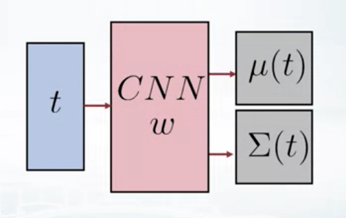
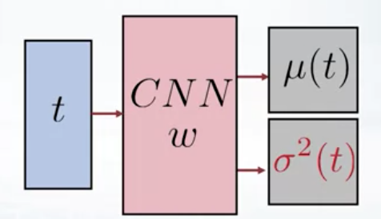
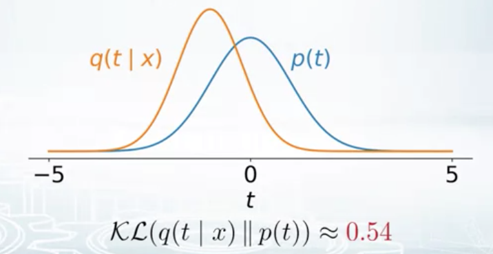
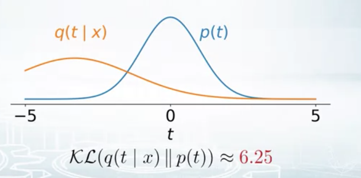
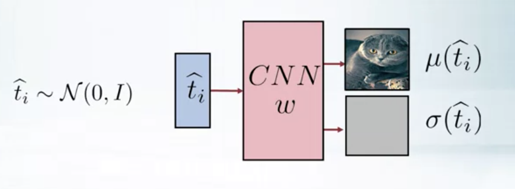
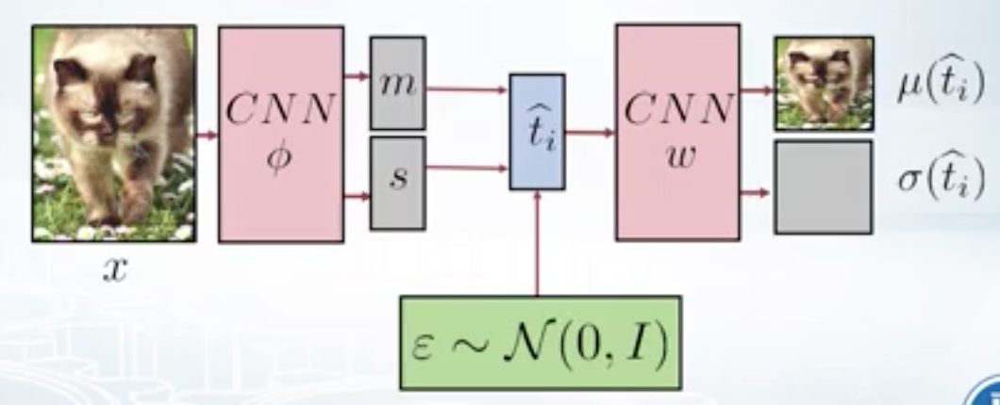

# Stochastic Variational Inference and Variational Autoencoders

Let's start with the problem of fitting a probability distribution $p(x)$ into a data set of points. This is the problem of _generative modeling_ where one aims to learn a joint distribution over a set of variables. This is the main difference between discriminative and generative modeling. While in _discriminative modeling_, one aims to learn the predictor from a set of observations, in generative modeling one simulates how the data is generated
in the real world. Generative modeling gives one an understanding of the generative process of data and naturally expresses causal relations of the world.

Depending on the complexity of the data being fit we can think of using models like Gaussian model, [Gaussian Mixture model](https://en.wikipedia.org/wiki/Mixture_model) or [Probabilistic PCA](http://www.robots.ox.ac.uk/~cvrg/hilary2006/ppca.pdf) to fit the distribution. But it's a matter of fact that none of these methods are able to handle the complexity of complicated dataset like natural images. In this document we will explore various options of how to model $p(x)$ till we find a suitable way that can handle a complex dataset like natural images.

## Why Model $p(x)$

We may like to fit the dataset of natural images into a probabilistic distribution for the following use cases:

* **Generate new images**. We may try Gaussian Mixture models but it will not work well as some of the more sophisticated models that we discuss below.
* **Fraud / Outlier / Anomaly detection**. A very frequent use case would be one related to banks or other financial institutions. You fit your probabilistic model on the regular transactions (training dataset) - when a new transaction comes you can predict if it's a normal one or a fraudulent one.
* **Work with missing data**. You have some images with obscured parts, and you want to do predictions. In this case, if you have ${p}(x)$, so probability of your data, it will help you greatly to deal with it.
* **Represent complex structured data in low level embeddings**. This is also the essence of latent variable based models. Each object gets a code in the latent space which can be explored for more details.

## How to Model $p(x)$ - some options

The main focus of this docyment is to find options to model $p(x)$, where $x$ is a complicated data like a natural image. In this section we will take a look at why some of the simpler models don't work for our use case. In the following sections we will work our way into the world of stochastic variational inference and see how it gives us a suitable generative model for natural images.

### Use a Convolutional Neural Network

One way to think of modeling ${p}(x)$ would be use a convolutional neural net that accepts an image and returns the probability for that image. 

* $\log \widehat{p}(x)=\mathrm{CNN}(x)$

Looks like it's the simplest possible parametric model that should work, given the fact that CNNs work very well with images.

The problem with this approach is that you have to normalize your distribution. You have to make your distribution to sum up to one, with respect to sum according to _all possible images in the world_, and there are billions of them. So, this normalization constant is very expensive to compute, and you have to compute it to do the training or inference in the proper manner. 

* $p(x)=\frac{\exp (\mathrm{CNN}(x))}{Z}$

So, this is infeasible. You can't do that because of normalization. 

### Use an RNN to model Chain Rule of Conditional Distributions

Think of modeling ${p}(x)$ for an image as a joint distribution over the individual pixels, ${p\left(x_{1}, \ldots, x_{d}\right)}$, which, by chain rule, can be decomposed into a product of some conditional distributions, ${p\left(x_{1}\right) p\left(x_{2} | x_{1}\right) \ldots p\left(x_{d} | x_{1}, \ldots, x_{d-1}\right)}$. Now you can try to build this conditional probability models to model the overall joint probability. 

The most natural way to model this conditional probability distribution is through a Recurrent Neural Network (RNN), $p\left(x_{k} | x_{1}, \ldots, x_{k-1}\right)=\operatorname{RNN}\left(x_{1}, \ldots, x_{k-1}\right)$. The RNN will read the image pixel by pixel and will try to predict the next pixel. In this approach we don;t have the issue of dealing with a large normalization constant as the RNN needs to think only about one dimensional distribution. So, if for example, your image is grayscale, then each pixel can be decoded with the number from zero to 255. So, the brightness level, and then your normalization constant can be computed by just summing up with respect to all these 256 values, so it's easy. The problem with this approach is that the image generation process is pixelwise and hence very slow.

### Assume Independent Pixel Distribution

Can we assume that the distribution over the pixels are independent ? In that case we have this $p\left(x_{1}, \ldots, x_{d}\right)=p\left(x_{1}\right) \ldots p\left(x_{d}\right)$ factorization which makes life so simpler. But, as it turns out, this looks like a very naive assumption and a too restricted model, as images tend to have correlated pixels in almost all cases.

### Gaussian Mixture Models

Theoretically you can use this technique as it can represent any probability distribution. But in practice for a complicated dataset like natural images, this can be really inefficient. You may need to use thousands of Gaussians that will make it too hard to train the model.

### Infinite mixture of Gaussians

Here we can use a latent variable model, where each data item $x_{i}$ is caused by a latent variable ${t}$ and we can marginalize out ${t}$, $p(x)=\int p(x | t) p(t) d t$. The conditional here can be a Gaussian and we, kind of, have a mixture of infinitely many Gaussians. For each value of ${t}$, there's one Gaussian and we mix them with weights. Note here that, _even if the Gaussians are factorized, so they have independent components for each dimension, the mixture is not_. So, this is a little bit more powerful model than the Gaussian mixture model. We will explore this model more in the next section.

## Latent Variable Models

Let's start with a model based on the continuous mixture of Gaussians: $p(x)=\int p(x | t) p(t) d t$. It's a [latent variable model](https://www.microsoft.com/en-us/research/publication/latent-variable-models/) that will serve as the baseline on which we will apply successive refinements to add more generative power.

### Defining the Model

To complete the model we need to define the prior and the likelihood:

* We use a standard Normal prior : ${p(t)=\mathcal{N}(0, I)}$. It will just force the latent variables t to be around zero and with some unique variants.  

* We use Gaussian likelihood with the parameters of the Gaussian determined by the latent variable ${t}$: ${p(x | t)=\mathcal{N}(\mu(t), \Sigma(t))}$

Now we need to find a way to convert ${t}$ to the parameters of the Gaussian in the likelihood. One option is to use a linear function for this transformation, somewhat similar to what we do for Probabilistic PCA:

* $\mu(t)=W t+b, \Sigma(t)=\Sigma_{0}$

But as it turns out, this is not powerful enough to model complicated structures like natural images. If linearity isn't powerful enough, let's think in terms of non linear transformations.

### Deep Learning to the rescue

A Neural Network is a universal function approximator. Let's use the power of non linearity that a Convolutional Neural Net (CNN) offers. We input $t$ to two CNNs and have them generate the sufficient statistics needed to model the Gaussian distribution.

* $\begin{array}{l}{\mu(t)=\mathrm{CNN}_{1}(t)} \\ {\Sigma(t)=\mathrm{CNN}_{2}(t)}\end{array}$

We have one CNN that takes as input the latent variable ${t}$ and outputs the mean vector for the image ${\mu}$. Another CNN takes the latent variable ${t}$ and outputs the covariance matrix ${\Sigma}$. This will define our model in some parametric form.

Also we need some weights ${w}$ for our neural networks which will be set during the training of the CNNs. Here's what we have for the model so far:

* The **latent variable model** for the density estimation, which is a mixture of Gaussians: 
 * ${p(x | w)=\int p(x | t, w) p(t) d t}$

* **Prior and likelihood** as Gaussians: 
 * $\begin{array}{l}{p(t)=\mathcal{N}(0, I)} \\ {p(x | t, w)=\mathcal{N}(\mu(t, w), \Sigma(t, w))}\end{array}$

 

 
Fig 1: The Model

 
But here we have a computational problem. If our images are of size 100 x 100, then each image has 10000 pixels, which by the way, is fairly low resolution. But even in this case the covariance matrix $\Sigma$ will have a size 10000 x 10000, which is too big for the CNN to output. One way to simplify this is instead of using the full covariance matrix, let's just assume that $\Sigma$ will be a diagonal matrix with NN weights only on the diagonals. Here's how the likelihood of the model changes:
 
* $\begin{array}{l}{p(t)=\mathcal{N}(0, I)} \\ {p(x | t, w)=\mathcal{N}\left(\mu(t, w), \operatorname{diag}\left(\sigma^{2}(t, w)\right)\right)}\end{array}$

and we have the following model:
 
 

 
Fig 2: The Model with diagonal covariance matrix

### Training the Model

Now that we have the model, we need to train it somehow. And we will use Maximum Likelihood Estimation for this - maximize the density of our dataset given the parameters (which come from the convolutional neural network). Here's the integral that does this by marginalizing out the latent variable ${t}$:

* $\max _{w} p(X | w)=\int p(X | T, w) p(T) d t$

Since we have a latent variable model, let's try and use the [Expectation Maximization](https://en.wikipedia.org/wiki/Expectation%E2%80%93maximization_algorithm) (EM) algorithm. It is specifically invented for these kinds of models. 

##### Trying to use the EM algorithm

In EM algorithm: 

1. we develop a lower bound for the log likelihood $\log p(X | w)$, $\mathcal{L}(w, q)$ that depends on weights ${w}$ and a new variational distribution parameter ${q}$ and 
2. maximize this lower bound with respect to both ${w}$ and ${q}$, $\underset{w, q}{\operatorname{maximize}} \mathcal{L}(w, q)$ so as to get the bound as close to the actual logarithm of the marginal likelihood as possible.

For more details on the [Expectation Maximization Algorithm and Latent Variable Models](https://krasserm.github.io/2019/11/21/latent-variable-models-part-1/), here's an excellent post by Martin Krasser.

But there is a problem. In the E-step of EM we need to find the posterior of the latent variable $p(T | X, w)$. And this is intractable in this case because you need to compute integrals and you have CNNs in them. It is just too hard to do this analytically.

So plain EM is not the way to model our use case.

---

**Brief Recap: EM Algorithm**

* We find a lower bound for the log likelihood $\log p(X | \theta) \geq \mathcal{L}(\theta, q) \text { for any } q$, called the **Variational Lower Bound (VLB)**. Here ${q}$ is the variational distribution parameter.
 * $\log p(X | \theta) \geq \mathcal{L}(\theta, q)=\mathbb{E}_{q(T)} \log \frac{p(X, T | \theta)}{q(T)}$ 

* In the **E-step**, we maximize the VLB with respect to ${q}$, keeping ${\theta}$ fixed 
 * $q^{k+1}=\underset{q}{\arg \max } \mathcal{L}\left(\theta^{k}, q\right)$
 * which in turn implies that we need to minimize the KL divergence between the variational distribution ${q}$ and the posterior $q^{k+1}=\underset{q}{\arg \min } \mathcal{K} \mathcal{L}\left[q(T) \| p\left(T | X, \theta^{k}\right)\right]$
 * and this can be done by setting the variational distribution to be equal to the value of the posterior $q^{k+1}\left(t_{i}\right)=p\left(t_{i} | x_{i}, \theta^{k}\right)$

* In the **M-step**, we maximize the VLB with respect to ${\theta}$ using the ${q}$ we got from the E-step
 * $\theta^{k+1}=\underset{\theta}{\arg \max } \mathcal{L}\left(\theta, q^{k+1}\right)$
 * which, in turn sets ${\theta}$, $\theta^{k+1}=\underset{\theta}{\arg \max } \mathbb{E}_{q^{k+1}} \log p(X, T | \theta)$

* We repeat E-step and M-step till convergence

---

We could also use [MCMC](https://en.wikipedia.org/wiki/Markov_chain_Monte_Carlo) in the M-step and approximate the expectation (with respect to ${q}$) with samples:

* $\begin{array}{l}{\mathbb{E}_{q} \log p(X, T | w) \approx \frac{1}{M} \sum_{s=1}^{M} \log p\left(X, T_{s} | w\right)} \\ {T_{s} \sim q(T)}\end{array}$

and then we can maximize this average instead of the expected value. But this will be very slow. In each step of the EM algorithm we need to collect a number of samples using Monte Carlo till convergence. So you have nested loops here - an outer loop for EM algorithm and an inner loop for sampling using MCMC. This will be slow. There are better alternatives that we can explore.

When plain EM algorithm doesn't work, we need to have approximations.

##### Using Variational Inference

Let's try to approximate further. How about choosing [Variational Inference](http://www.cs.uoi.gr/~arly/papers/SPM08.pdf), where we maximize the lower bound ($\log p(X | w) \geq \mathcal{L}(w, q)$) as above ($\underset{w, q}{\operatorname{maximize}} \mathcal{L}(w, q)$) (also known as the _Variational Lower Bound_ or _Evidence Lower Bound_, abbreviated the ELBO) in the EM algorithm but restricting the variational distribution to one _that can be factorized_ (i.e. $ q_{i}\left(t_{i}\right)=\widetilde{q}\left(t_{i 1}\right) \ldots \widetilde{q}\left(t_{i m}\right)$). However as it turns out, even this is intractable. We need to find out methods that scale the idea of variational inference for our latent variable model.

Besides being factorizable, let's also assume that the variational distribution of each individual object is Gaussian. So we have the following sequence of approximations:

$\underset{w, q}{\operatorname{maximize}} \mathcal{L}(w, q)$ **(Maximize lower bound as in Plain EM)**

$\Rightarrow$

$\underset{w, q_{1}, \ldots, q_{N}}{\operatorname{maximize}} \mathcal{L}\left(w, q_{1}, \ldots, q_{N}\right)$ subject to $q_{i}\left(t_{i}\right)=\widetilde{q}_{i}\left(t_{i 1}\right) \ldots \widetilde{q}_{i}\left(t_{i m}\right)$ **(Factorized variational distribution)**

$\Rightarrow$

$\underset{w, m_{1}, \ldots, s_{N} \atop s_{1}, \ldots, s_{N}}{\operatorname{maximize}} \mathcal{L}\left(w, q_{1}, \ldots, q_{N}\right)$ subject to $q_{i}\left(t_{i}\right)=\mathcal{N}\left(m_{i}, \operatorname{diag}\left(s_{i}^{2}\right)\right)$ **(Variational distribution for each object is a Gaussian)**. Each object will have a latent variable $t_{i}$ which will have it's own variational distribution $q_{i}$ and which will be parameterized by $m_{i}$ and $s_{i}$, which will be the parameters of our model which we will train. And then we will maximize our lower bound with respect to these parameters.

Looks like we are not yet out of the woods. We just added a number of parameters to our model. e.g. if our latent variables are of 50 dimensions, each of $m_{i}$ and $s_{i}$ will contribute 100 parameters per object to train. And if you have a million training objects, then we have 100 million more parameters just for the purpose of implementing an approximation model. The model will be very complex and will possibly overfit. Also it's not clear how to get these parameters for new objects during inference.

We cannot make all $q_{i}$'s same and yet we cannot afford to have all of them contribute such a huge number of parameters to the model. One approach to alleviate this problem is to have separate distribution for each object but all $q$'s will have a common form - we say that all $q_{i}$'s are of the same distribution (Gaussian) but have parameters that somehow depend on $x_{i}$'s and some weight. Here's the new optimization objective:

$\underset{w, \phi}{\operatorname{maximize}} \mathcal{L}\left(w, q_{1}, \ldots, q_{N}\right)$ subject to $q_{i}\left(t_{i}\right)=\mathcal{N}\left(m\left(x_{i}, \phi\right), \operatorname{diag}\left(s^{2}\left(x_{i}, \phi\right)\right)\right)$

> Note here, we still have all $q_{i}$'s different but all of them have the same form depending on only 2 parameters $m$ and $s$.

And for new objects during inference, we can easily find its variational approximation $q$. We can pass this new object through the function $m$, and $s$ to compute the parameters of its Gaussian.

Now we need to maximize this lower bound with respect to $w$ and $\phi$, the latter being the parameter that enables us to convert the $x_{i}$'s to the parameters of the distribution.

##### Computing m and s - the parameters for the Gaussian

We use a convolutional neural network (CNN) for this. This CNN will take as input the data object and will have its own parameter $\phi$ and output the values of $m$ and $s$:

Fig 3: CNN generates Variational Distribution parameters

##### The Variational Autoencoder

Earlier using plain EM algorithm we needed to maximize the lower bound which was defined as follows:

* $\begin{array}{l}{\mathbb{E}_{q} \log p(X, T | w) \approx \frac{1}{M} \sum_{s=1}^{M} \log p\left(X, T_{s} | w\right)} \\ {T_{s} \sim q(T)}\end{array}$

Here $q$ is the actual posterior of the latent variables and was complicated and we only knew upto the normalization constant. And sampling using MCMC was also found to be expensive and slow.

But now we approximate $q$ with a Gaussian and we know how to compute the parameters of this Gaussian. So we can pass an object $x$ through a CNN with parameter $\phi$ and obtain the values of $m$ and $s$, the parameters of the Gaussian. Now we can easily sample from this Gaussian to approximate the expected value. _Thus we have converted the intractable expectation into a value through sampling_, because sampling is now cheap - we are sampling from Gaussians:

* $\widehat{t}_{i} \sim \mathcal{N}\left(m\left(x_{i}, \phi\right), \operatorname{diag}\left(s^{2}\left(x_{i}, \phi\right)\right)\right.$

And refer to Fig 2 as to how we defined our model ${p(x | t, w)}$ using a CNN - we will feed the current CNN's output (see Fig 3) into the CNN in Fig 2. This is how the overall workflow looks like:

1. Start with an object $x$ and pass through the first CNN with parameter $\phi$
2. We get the parameters $m$ and $s$ of the variational distribution $q_{i}$
3. We sample from this distribution, one data point, which is a random variable
4. We then pass this just sampled vector of latent variable $t_{i}$ into the second neural network - another CNN with parameter $w$
5. This second CNN outputs the distribution on the images. The structure of the model will be such that the new images are as close to the input images as possible

Here's the overall schematic diagram of the full model architecture:

Fig 4: The Complete Workflow

This architecture is called [Variational Autoencoder](https://arxiv.org/abs/1312.6114) (VAE), as opposed to plain Autoencoders, as it has some sampling and variational approximations as part of the model. 

The VAE can be viewed as two coupled, but independently parameterized models:

* the first part of the network called the _Encoder_ (or _Recognition Model_ or the _Inference Model_) - it encodes the input image to the latent code and delivers to the generative model an approximation to its posterior over latent random variables ($\widehat{t}_{i}$ in Fig 4)
* the second part is called the _Decoder_ (or _Generative Model_) - decodes the latent code back to the image. The Decoder learns meaningful representations of the data and is the approximate inverse of the generative model according to Bayes rule.

In the model that we built so far, if we take away the variance part $s$ i.e. if $s(x)=0$ then $\widehat{t}_{i}=m\left(x_{i}, \phi\right)$, which means the variational distribution is a deterministic one - it always outputs the mean value (no stochasticity). That is equivalent to passing $m$ directly to the second CNN, the decoder. This changes a variational autoencoder to a plain autoencoder where the input gets replicated to the output. So, it is the variance of the variational distribution that makes this model a variational autoencoder.

In the monograph [An Introduction to Variational Autoencoders](https://arxiv.org/abs/1906.02691), Diederik P. Kingma Max Welling sums this up beautifully:

> One advantage of the VAE framework, relative to ordinary Variational Inference (VI), is that the recognition model (also called inference model) is now a (stochastic) function of the input variables. This in contrast to VI where each data-case has a separate variational distribution, which is inefficient for large data-sets. The recognition model uses one set of parameters to model the relation between input and latent variables and as such is called “amortized inference”. This recognition model can be arbitrary complex but is still reasonably fast because by construction it can be done using a single feedforward pass from input to latent variables.

**Assumptions Made by a VAE** 

VAEs make strong assumptions about the posterior distribution. Typically VAE models assume that the posterior is approximately factorial, and that its parameters can be predicted from the observables through a nonlinear regression

##### A Deeper Look at the Optimization Objective

Let's take a deeper look at the optimization objective (the variational lower bound) of a VAE. For details on the derivation of the lower bound for a general form of EM algorithm, take a look at Martin's post on [Expectation Maximization](https://krasserm.github.io/2019/11/21/latent-variable-models-part-1/). This VLB
 can be expressed as the sum of two terms as follows:

* $\max . \sum_{i} \mathbb{E}_{q_{i}} \log \frac{p\left(x_{i} | t_{i}, w\right) p\left(t_{i}\right)}{q_{i}\left(t_{i}\right)}$ $=\sum_{i} \mathbb{E}_{q_{i}} \log p\left(x_{i} | t_{i}, w\right)+\mathbb{E}_{q_{i}} \log \frac{p\left(t_{i}\right)}{q_{i}\left(t_{i}\right)}$

 * In the above expression, the second term of the sum is the negative of the KL divergence between the variational distribution $q$ and the prior ${p\left(t_{i}\right)}$ i.e. $-\mathcal{K} \mathcal{L}\left(q_{i}\left(t_{i}\right) \| p\left(t_{i}\right)\right)$. Maximizing the negative of the KL divergence implies minimization of the KL divergence which actually pushes the variational distribution $q_{i}$ towards the value of the prior (which is standard Normal as per our earlier discussion), since KL divergence can never be negative.

* $\max . \sum_{i} \mathbb{E}_{q_{i}} \log \frac{p\left(x_{i} | t_{i}, w\right) p\left(t_{i}\right)}{q_{i}\left(t_{i}\right)}$ $=\sum_{i} \mathbb{E}_{q_{i}} \underbrace{\log p\left(x_{i} | t_{i}, w\right)}_{-\left\|x_{i}-\mu\left(t_{i}\right)\right\|^{2}+\text { const }}-\mathcal{K} \mathcal{L}\left(q_{i}\left(t_{i}\right) \| p\left(t_{i}\right)\right)$

 * If we set all the output variances to be 1 ($\sigma\left(x_{i}\right)=1$), then the log likelihood $\log p\left(x_{i} | t_{i}, w\right)$ is equal to the negative of the Euclidean distance between $x_{i}$ and the predicted mean of $t_{i}$, which is $-\left\|x_{i}-\mu\left(t_{i}\right)\right\|^{2}+\text { const }$. This is actually the _reconstruction loss_ - it tries to push $x_{i}$ as close to the reconstruction as possible (remember that our model outputs the mean vector for the reconstructed image). This is what an usual autoencoder does as well. But it's the second term that makes the difference in VAE. The KL divergence acts as the _regularizer_ and adds stochasticity (noise) to the variational distribution. And this helps in implementing various use cases of VAE like outlier detection, as we will see in the next section.

##### Outlier Detection - A usecase for VAE

The optimization objection of the VAE has a KL divergence as one of the components, which we try to minimize and pull the variational distribution $q_{i}$ towards the prior distribution, which we decided to be a Standard Gaussian. So when our VAE model receives an object similar to what it has seen before and is passed through the encoder, it will output a distribution $q_{i}$ that will be close to standard Gaussian.

Fig 5: Normal Data

But when the model receives an image that it has never seen or it is completely different from what it was trained on, the encoder will output a distribution which is far from standard Gaussian. These data can be classified as outliers or anomalous.

Fig 6: Outlier Data

##### Generate New Samples

Note that the model of VAE is defined as this integral with respect to $t$, $p(x | w)=\int p(x | t, w) p(t) d t$, we can generate new samples in two steps:

1. Sample from prior to get a standard Gaussian
2. Pass it through the decoder network to generate a new image

Fig 7: Decoder generates new samples

##### Maximizing the Objective

Let's now take a detailed look at how we can maximize the objective of VAE, which is given by $\max _{w, \phi} . \sum_{i} \mathbb{E}_{q_{i}} \log p\left(x_{i} | t_{i}, w\right)-\mathcal{K} \mathcal{L}\left(q_{i}\left(t_{i}\right) \| p\left(t_{i}\right)\right)$. Now we need to maximize this objective with respect to the parameters $w$ and $\phi$ of the two neural networks. And since we have an expectation inside we need to make use of MCMC sampling.

The second part of the expression, the KL divergence part, is easy to be computed analytically. The KL divergence can be expressed as $\mathcal{K} \mathcal{L}\left(q_{i}\left(t_{i}\right) \| p\left(t_{i}\right)\right)$ = $\sum_{j}\left(-\log \sigma_{j}\left(t_{i}\right)+\frac{\sigma_{j}^{2}\left(t_{i}\right)+\mu_{j}^{2}\left(t_{i}\right)-1}{2}\right)$, which can be easily evaluated and it should be easy to compute the gradients as well. Tensorflow will be happy to do this.

The first part is more challenging. Let's call this expression $f(w, \phi)=\sum_{i} \mathbb{E}_{q_{i}} \log p\left(x_{i} | t_{i}, w\right)$, which is a sum over all objects of the expectation of the logarithm of a conditional probability. In order to maximize we need to find the gradients of this expression with respect to $w$ and $\phi$.

##### Finding the Gradient with respect to $w$

Recall that we decided that each $q_{i}$ of individual object will be a distribution of $t_{i}$ given $x_{i}$ and $\phi$ and is modeled as a CNN with parameter $\phi$, $q_{i}\left(t_{i}\right)=q\left(t_{i} | x_{i}, \phi\right)=\mathcal{N}\left(m_{i}, \operatorname{diag}\left(s_{i}^{2}\right)\right)$. Then we have $f(w, \phi)=\sum_{i} \mathbb{E}_{q\left(t_{i} | x_{i}, \phi\right)} \log p\left(x_{i} | t_{i}, w\right)$.

Let's first look at the gradient of this function with respect to $w$, which looks as follows:

$\nabla_{w} f(w, \phi)=\nabla_{w} \sum_{i=1}^{N} \mathbb{E}_{q\left(t_{i} | x_{i}, \phi\right)} \log p\left(x_{i} | t_{i}, w\right)$

&nbsp;&nbsp;&nbsp;&nbsp;&nbsp;&nbsp;&nbsp;&nbsp;&nbsp;&nbsp;&nbsp;&nbsp;&nbsp;&nbsp;&nbsp;&nbsp;&nbsp;&nbsp;&nbsp;**(replacing expectation by its definition)**

&nbsp;&nbsp;&nbsp;&nbsp;&nbsp;&nbsp;&nbsp;&nbsp;&nbsp;&nbsp;&nbsp;&nbsp;&nbsp;&nbsp;&nbsp;&nbsp;&nbsp;&nbsp;&nbsp;$=\nabla_{w} \sum_{i=1}^{N} \int q\left(t_{i} | x_{i}, \phi\right) \log p\left(x_{i} | t_{i}, w\right) d t_{i}$ 

&nbsp;&nbsp;&nbsp;&nbsp;&nbsp;&nbsp;&nbsp;&nbsp;&nbsp;&nbsp;&nbsp;&nbsp;&nbsp;&nbsp;&nbsp;&nbsp;&nbsp;&nbsp;&nbsp;**(move gradient inside the summation)**

&nbsp;&nbsp;&nbsp;&nbsp;&nbsp;&nbsp;&nbsp;&nbsp;&nbsp;&nbsp;&nbsp;&nbsp;&nbsp;&nbsp;&nbsp;&nbsp;&nbsp;&nbsp;&nbsp;$=\sum_{i} \nabla_{w} \int q\left(t_{i} | x_{i}, \phi\right) \log p\left(x_{i} | t_{i}, w\right) d t_{i}$ 

&nbsp;&nbsp;&nbsp;&nbsp;&nbsp;&nbsp;&nbsp;&nbsp;&nbsp;&nbsp;&nbsp;&nbsp;&nbsp;&nbsp;&nbsp;&nbsp;&nbsp;&nbsp;&nbsp;**(swap gradient and the integral)**

&nbsp;&nbsp;&nbsp;&nbsp;&nbsp;&nbsp;&nbsp;&nbsp;&nbsp;&nbsp;&nbsp;&nbsp;&nbsp;&nbsp;&nbsp;&nbsp;&nbsp;&nbsp;&nbsp;$=\sum_{i} \int \nabla_{w} q\left(t_{i} | x_{i}, \phi\right) \log p\left(x_{i} | t_{i}, w\right) d t_{i}$ 

&nbsp;&nbsp;&nbsp;&nbsp;&nbsp;&nbsp;&nbsp;&nbsp;&nbsp;&nbsp;&nbsp;&nbsp;&nbsp;&nbsp;&nbsp;&nbsp;&nbsp;&nbsp;&nbsp;**($q$ is independent of $w$)**

&nbsp;&nbsp;&nbsp;&nbsp;&nbsp;&nbsp;&nbsp;&nbsp;&nbsp;&nbsp;&nbsp;&nbsp;&nbsp;&nbsp;&nbsp;&nbsp;&nbsp;&nbsp;&nbsp;$=\sum_{i} \int q\left(t_{i} | x_{i}, \phi\right) \nabla_{w} \log p\left(x_{i} | t_{i}, w\right) d t_{i}$ 

&nbsp;&nbsp;&nbsp;&nbsp;&nbsp;&nbsp;&nbsp;&nbsp;&nbsp;&nbsp;&nbsp;&nbsp;&nbsp;&nbsp;&nbsp;&nbsp;&nbsp;&nbsp;&nbsp;**(by definition of expectation)**

&nbsp;&nbsp;&nbsp;&nbsp;&nbsp;&nbsp;&nbsp;&nbsp;&nbsp;&nbsp;&nbsp;&nbsp;&nbsp;&nbsp;&nbsp;&nbsp;&nbsp;&nbsp;&nbsp;$=\sum_{i} \mathbb{E}_{q\left(t_{i} | x_{i}, \phi\right)} \nabla_{w} \log p\left(x_{i} | t_{i}, w\right)$ 

&nbsp;&nbsp;&nbsp;&nbsp;&nbsp;&nbsp;&nbsp;&nbsp;&nbsp;&nbsp;&nbsp;&nbsp;&nbsp;&nbsp;&nbsp;&nbsp;&nbsp;&nbsp;&nbsp;**(we can approximate the expected value by sampling, where $\widehat{t_{i}} \sim q\left(t_{i} | x_{i}, \phi\right)$)**

&nbsp;&nbsp;&nbsp;&nbsp;&nbsp;&nbsp;&nbsp;&nbsp;&nbsp;&nbsp;&nbsp;&nbsp;&nbsp;&nbsp;&nbsp;&nbsp;&nbsp;&nbsp;&nbsp;$\approx \sum_{i} \nabla_{w} \log p\left(x_{i} | \widehat{t}_{i}, w\right)$ 

So we sample one point $\widehat{t_{i}}$ from the variational distribution $q\left(t_{i} | x_{i}, \phi\right)$, and use that within the logarithm and then compute the gradient with respect to $w$.

Basically what we are doing here is the following (see Fig 4 for the complete workflow):

1. Passing our image through the encoder CNN and get the parameters of our variational distribution $q\left(t_{i}\right)$
2. Sample one point from the variational distribution
3. Put this point as input to the second CNN with parameter $w$
4. Compute the usual gradient of this second neural network with respect to its parameters given this input $\widehat{t_{i}}$. This is standard gradient computation which we can do through Tensorflow.

Note that the above computation depends on the whole data set though we can easily transform it to a minibatch based computation:

$\begin{aligned} \nabla_{w} f(w, \phi) & \approx \sum_{i=1}^{N} \nabla_{w} \log p\left(x_{i} | \widehat{t}_{i}, w\right) \\ & \approx \frac{N}{n} \sum_{s=1}^{n} \nabla_{w} \log p\left(x_{i_{s}} | \widehat{t}_{i_{s}}, w\right) \\ & \text { Stochastic gradient of standard NN } \end{aligned}$

$\begin{aligned} \widehat{t}_{i} & \sim q\left(t_{i} | x_{i}, \phi\right) \\ i_{s} & \sim \mathcal{U}\{1, \ldots, N\} \end{aligned}$

##### Finding the Gradient with respect to $\phi$

Here's the objective:

$\nabla_{\phi} f(w, \phi)=\nabla_{\phi} \sum_{i} \mathbb{E}_{q\left(t_{i} | x_{i}, \phi\right)} \log p\left(x_{i} | t_{i}, w\right)$

&nbsp;&nbsp;&nbsp;&nbsp;&nbsp;&nbsp;&nbsp;&nbsp;&nbsp;&nbsp;&nbsp;&nbsp;&nbsp;&nbsp;&nbsp;&nbsp;&nbsp;&nbsp;&nbsp;**(replacing expectation by its definition)**

&nbsp;&nbsp;&nbsp;&nbsp;&nbsp;&nbsp;&nbsp;&nbsp;&nbsp;&nbsp;&nbsp;&nbsp;&nbsp;&nbsp;&nbsp;&nbsp;&nbsp;&nbsp;&nbsp;$=\nabla_{\phi} \sum_{i} \int q\left(t_{i} | x_{i}, \phi\right) \log p\left(x_{i} | t_{i}, w\right) d t_{i}$

&nbsp;&nbsp;&nbsp;&nbsp;&nbsp;&nbsp;&nbsp;&nbsp;&nbsp;&nbsp;&nbsp;&nbsp;&nbsp;&nbsp;&nbsp;&nbsp;&nbsp;&nbsp;&nbsp;**(move the expected value inside the summation and swap integral and diff)**

&nbsp;&nbsp;&nbsp;&nbsp;&nbsp;&nbsp;&nbsp;&nbsp;&nbsp;&nbsp;&nbsp;&nbsp;&nbsp;&nbsp;&nbsp;&nbsp;&nbsp;&nbsp;&nbsp;$=\sum_{i} \int \nabla_{\phi} q\left(t_{i} | x_{i}, \phi\right) \log p\left(x_{i} | t_{i}, w\right) d t_{i}$

Now we have a problem. Unlike the case when we found the gradient with respect to $w$, we cannot move the differential $\nabla_{\phi}$ before the logarithm. This is because $q$ depends on $\phi$. And if we differentiate $q$ with respect to $\phi$ we no longer get the form of an expectation from which we can sample using Monte Carlo.

We can however do a trick. Let's introduce some distribution artificially and multiply and divide by the distribution $q$:

&nbsp;&nbsp;&nbsp;&nbsp;&nbsp;&nbsp;&nbsp;&nbsp;&nbsp;&nbsp;&nbsp;&nbsp;&nbsp;&nbsp;&nbsp;&nbsp;&nbsp;&nbsp;&nbsp;$=\sum_{i} \int \frac{q\left(t_{i} | x_{i}, \phi\right)}{q\left(t_{i} | x_{i}, \phi\right)} \nabla_{\phi} q\left(t_{i} | x_{i}, \phi\right) \log p\left(x_{i} | t_{i}, w\right) d t_{i}$

&nbsp;&nbsp;&nbsp;&nbsp;&nbsp;&nbsp;&nbsp;&nbsp;&nbsp;&nbsp;&nbsp;&nbsp;&nbsp;&nbsp;&nbsp;&nbsp;&nbsp;&nbsp;&nbsp;**(using the fact $\nabla \log g(\phi)=\frac{\nabla g(\phi)}{g(\phi)}$)**

&nbsp;&nbsp;&nbsp;&nbsp;&nbsp;&nbsp;&nbsp;&nbsp;&nbsp;&nbsp;&nbsp;&nbsp;&nbsp;&nbsp;&nbsp;&nbsp;&nbsp;&nbsp;&nbsp;$=\sum_{i} \int q\left(t_{i} | x_{i}, \phi\right) \nabla_{\phi} \log q\left(t_{i} | x_{i}, \phi\right) \log p\left(x_{i} | t_{i}, w\right) d t_{i}$

&nbsp;&nbsp;&nbsp;&nbsp;&nbsp;&nbsp;&nbsp;&nbsp;&nbsp;&nbsp;&nbsp;&nbsp;&nbsp;&nbsp;&nbsp;&nbsp;&nbsp;&nbsp;&nbsp;**(now we have the form of an expectation)**

&nbsp;&nbsp;&nbsp;&nbsp;&nbsp;&nbsp;&nbsp;&nbsp;&nbsp;&nbsp;&nbsp;&nbsp;&nbsp;&nbsp;&nbsp;&nbsp;&nbsp;&nbsp;&nbsp;$=\sum_{i} \mathbb{E}_{q\left(t_{i} | x_{i}, \phi\right)} \nabla_{\phi} \log q\left(t_{i} | x_{i}, \phi\right) \log p\left(x_{i} | t_{i}, w\right) d t_{i}$

This is often referred to as the [Log Derivative Trick](http://blog.shakirm.com/2015/11/machine-learning-trick-of-the-day-5-log-derivative-trick/). Now you can sample from $q$ and approximate using Monte Carlo.

This is a valid approach and can be used to generate approximations using Monte Carlo. However it can be shown that this approximation is really quite loose and will result in a very high variance. For more details on why this variance is high, have a look at the paper [Neural Variational Inference and Learning in Belief Networks](https://www.cs.toronto.edu/~amnih/papers/nvil.pdf)

##### The Reparameterization Trick

Let's explore an idea to reduce the variance of the stochastic approximation that we saw in the last section.

Here's what we have as the objective:

$\nabla_{\phi} f(w, \phi)=\sum_{i} \nabla_{\phi} \mathbb{E}_{q\left(t_{i} | x_{i}, \phi\right)} \log p\left(x_{i} | t_{i}, w\right)$, where $t_{i}$ is sampled from $q$ as $t_{i} \sim q\left(t_{i} | x_{i}, \phi\right)=\mathcal{N}\left(m_{i}, \operatorname{diag}\left(s_{i}^{2}\right)\right)$

Let's do a change of variable. Instead of sampling $t_{i}$ let's sample a new element $\epsilon_{i}$ from standard Normal, $\varepsilon_{i} \sim p\left(\varepsilon_{i}\right)=\mathcal{N}(0, I)$ and make $t_{i}$ from it through an elementwise multiplication with the standard deviation and adding the mean vector to it, $t_{i}=\varepsilon_{i} \odot s_{i}+m_{i}$.

So we have $t_{i}=\varepsilon_{i} \odot s_{i}+m_{i}=g\left(\varepsilon_{i}, x_{i}, \phi\right)$ and instead of sampling from $q$ we sample from a  distribution $\epsilon_{i}$:

$\nabla_{\phi} f(w, \phi)=\sum_{i} \nabla_{\phi} \mathbb{E}_{q\left(t_{i} | x_{i}, \phi\right)} \log p\left(x_{i} | t_{i}, w\right)$

&nbsp;&nbsp;&nbsp;&nbsp;&nbsp;&nbsp;&nbsp;&nbsp;&nbsp;&nbsp;&nbsp;&nbsp;&nbsp;&nbsp;&nbsp;&nbsp;&nbsp;&nbsp;&nbsp;**(change of variable)**

&nbsp;&nbsp;&nbsp;&nbsp;&nbsp;&nbsp;&nbsp;&nbsp;&nbsp;&nbsp;&nbsp;&nbsp;&nbsp;&nbsp;&nbsp;&nbsp;&nbsp;&nbsp;&nbsp;$=\sum_{i} \nabla_{\phi} \mathbb{E}_{p\left(\varepsilon_{i}\right)} \log p\left(x_{i} | g\left(\varepsilon_{i}, x_{i}, \phi\right), w\right)$

&nbsp;&nbsp;&nbsp;&nbsp;&nbsp;&nbsp;&nbsp;&nbsp;&nbsp;&nbsp;&nbsp;&nbsp;&nbsp;&nbsp;&nbsp;&nbsp;&nbsp;&nbsp;&nbsp;**(now we can push the gradient inside the expectation)**

&nbsp;&nbsp;&nbsp;&nbsp;&nbsp;&nbsp;&nbsp;&nbsp;&nbsp;&nbsp;&nbsp;&nbsp;&nbsp;&nbsp;&nbsp;&nbsp;&nbsp;&nbsp;&nbsp;$=\sum_{i} \int p\left(\varepsilon_{i}\right) \nabla_{\phi} \log p\left(x_{i} | g\left(\varepsilon_{i}, x_{i}, \phi\right), w\right) d \varepsilon_{i}$

&nbsp;&nbsp;&nbsp;&nbsp;&nbsp;&nbsp;&nbsp;&nbsp;&nbsp;&nbsp;&nbsp;&nbsp;&nbsp;&nbsp;&nbsp;&nbsp;&nbsp;&nbsp;&nbsp;**(now we have an expectation without any additional distribution being introduced)**

&nbsp;&nbsp;&nbsp;&nbsp;&nbsp;&nbsp;&nbsp;&nbsp;&nbsp;&nbsp;&nbsp;&nbsp;&nbsp;&nbsp;&nbsp;&nbsp;&nbsp;&nbsp;&nbsp;$=\sum_{i} \mathbb{E}_{p\left(\varepsilon_{i}\right)} \nabla_{\phi} \log p\left(x_{i} | g\left(\varepsilon_{i}, x_{i}, \phi\right), w\right)$

Here's the modified workflow in the model:

Fig 8: Using the reparameterization trick

##### VAE Summary

* The model allows you to fit a probabilistic distribution into a complicated structure of data e.g. images using a model of infinite mixture of Gaussians.
* To define the parameters of these Gaussians, it uses a variational neural network with parameters that are trained with variational inference. And for learning, we can't use the usual expectation maximization because we have to approximate. And we can't also use variational expectation maximization because it is also intractable. So we draft a kind of stochastic version of variational inference. This model is applicable to large data sets, because we can use mini batches. Also we can use this for small data sets as we cannot use plain variational inference since it ahs neural networks and all integrals are intractable. This model is called the Variational Autoencoder.
* VAE is like plain autoencoders but it has noise inside. And the KL divergence regularization ensures that the noise stays.
* It can be used to generate new samples, detect outliers and missing data.